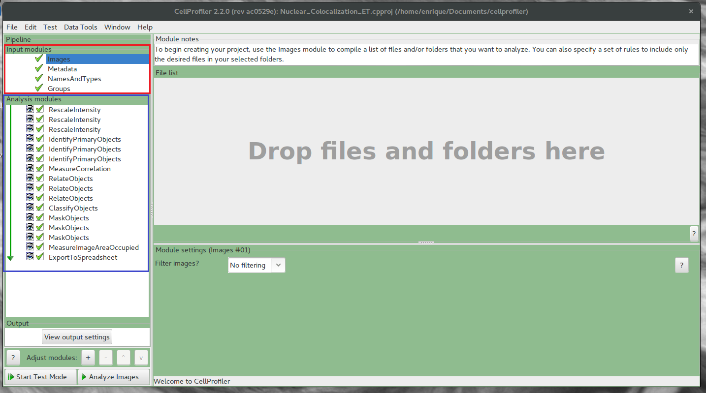
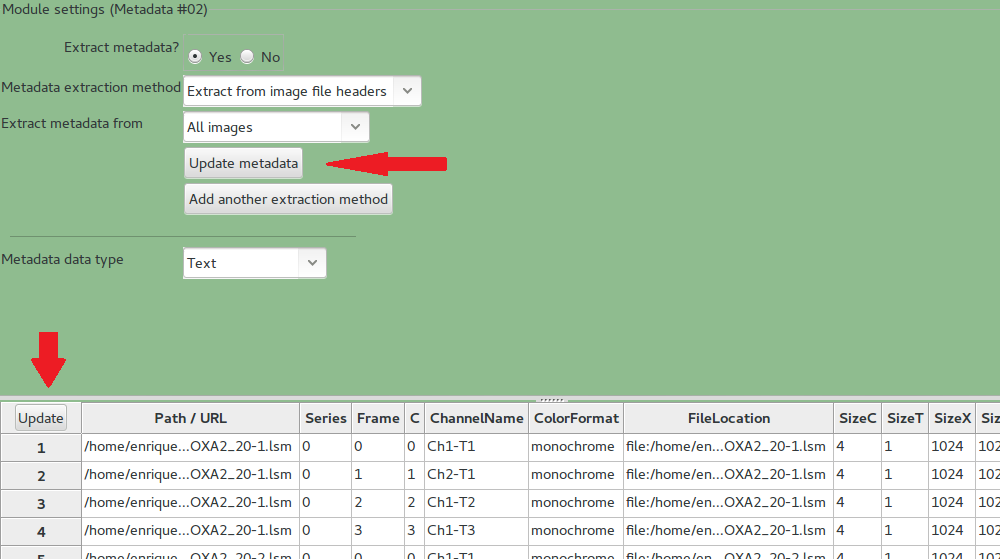
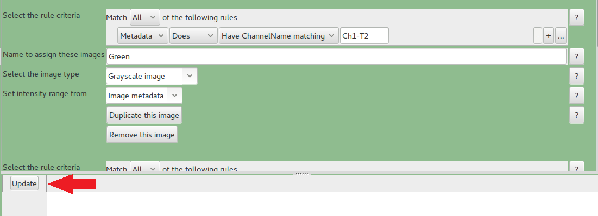
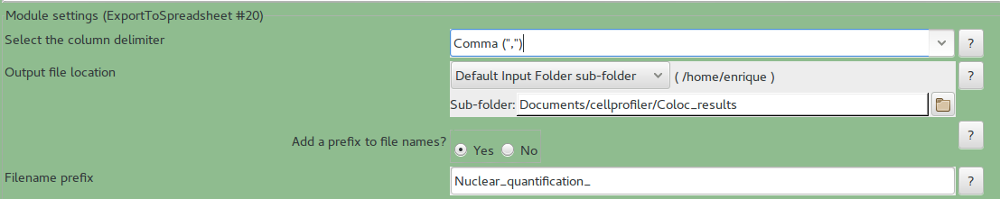

# Pipelines_CellProfiler

Automatic quantification of nuclear staining colocalization 

This pipeline is for analysis of LSM files of nuclear staining.

1. CellProfiler from http://cellprofiler.org/  available for OSX Windows and Linux 

Carpenter, Anne E., Thouis R. Jones, Michael R. Lamprecht, Colin Clarke, In Han Kang, Ola Friman, David A. Guertin et al. "CellProfiler: image analysis software for identifying and quantifying cell phenotypes." Genome biology 7, no. 10 (2006): R100.

2. Configure CellProfiler

In File -> Preference, set the default folder for the output

3. Load Pipeline file.

This file contains the instructions for the whole procedure

File -> Import   -> Import Pipeline from File -> *Nuclear_Colocalization_ET.cppipe*

In Red are the input modules that load the files and extract the metadata
In Blue are the analysis modules for the pipeline

4. Load Images (Input module - Images)

a) Right click where it said *"Drop files and folders here"*, you can also drag and drop them.
b) Select to show all files, not only image files.
c) Select all images to quantify and press open.

5. Input Module -Metadata

Press *Update metadata* and *Update*. This will populate the channels for each image in to the pipeline.

6. Input Module Names and Types

In ImageJ or Fiji open an image and check that the channel name (Ch1-T1, Ch1-T3, Ch2-T1? etc) and stain 

In here, each channel and stain should have a name. You should only change the channel name if it is needed.
Press Update to populate the table below.

7. Analysis module ExportToSpreadsheet

In here, select the right Output subfolder to save the results.

In Filename prefix_ you can change how the files are going to be called, by default all files are called Nuclear_quantification_(something).csv. Which can be opened in excel.

8. Analyze Images

| **Channel** | **Color** | **Objects**      | **Colocalization with nuclei** | **Colocalization with** |
|---------|-------|--------------|----------------------------|---------------------|
| Ch1-T1  | Blue  | Nuclei       | --                         | --                  |
| Ch1-T2  | Green | GreenObjects | GreenDAPI                  | RedGreen            |
| Ch1-T3  | Red   | RedObjects   | RedDAPI                    | RedGreen            |

Press Analyze Images

This will take a few minutes, depending of the images size, number and the computer.

On the output folder focus on the one called Nuclear_quantification_Image.csv

On the file the columns of interest are:
 
| **Column name**        | **Object counts**                           |
|--------------------|-----------------------------------------|
| Count_GreenDAPI    | Green objects with nuclear staining     |
| Count_GreenObjects | Total Green objects                     |
| Count_Nuclei       | Total Nuclei                            |
| Count_RedDAPI      | Red objects with nuclear staining       |
| Count_RedGreen     | Objects that are Red and Green positive |
| Count_RedObjects   | Total Red objects                       |
